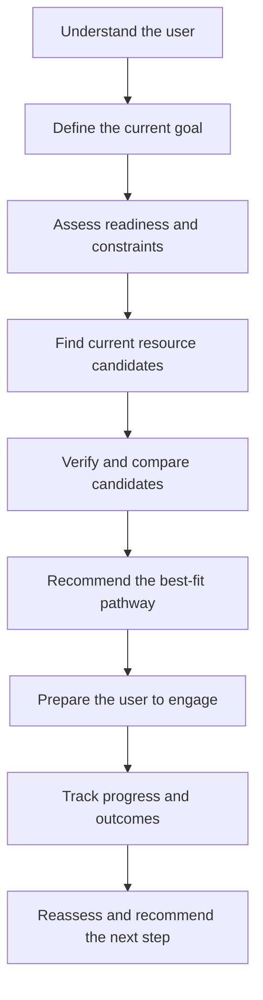

# resource_discovery_agent

## Purpose

The Resource Discovery Agent helps people identify, compare, prepare for, and successfully engage with programs and organizations that can support business ownership.

It is not a link directory. It is a guided decision-support system that turns a user’s goals, circumstances, location, readiness, and constraints into a personalized resource pathway.

The agent should help a user understand:

- which resource fits their current need;
- why it fits better than similar or duplicative options;
- what the program actually provides;
- whether the program appears relevant and currently available;
- how to contact or apply;
- what to prepare before contact;
- what questions to ask;
- what to expect during the process;
- how long the stage may take;
- what outcome or KPI indicates completion; and
- what the next logical resource or stage should be.

The primary outcome is not resource discovery alone. The primary outcome is successful, informed progress toward business ownership.

## Problem

Business-support information is fragmented across government agencies, community development corporations, universities, lenders, accelerators, training providers, technical-assistance organizations, and local programs.

Users often receive a list of links without enough context to act. Similar programs may appear interchangeable even when they differ in:

- eligibility;
- stage served;
- service depth;
- delivery format;
- geographic coverage;
- application timing;
- cost;
- funding structure;
- required documentation;
- expected time commitment; and
- likely outcome.

The Resource Discovery Agent resolves that problem by explaining functional differences, ranking fit, preparing the user for engagement, and tracking whether the resource produced the intended result.

## Core User Experience



The agent should ask only for information that materially changes the recommendation. It should refine the user profile over time instead of repeating the full intake during every interaction.

## Required Recommendation Output

Every recommended resource should include the following fields when the information is available:

| Field | Required explanation |
| --- | --- |
| Resource | Official program or organization name |
| Best fit | Who the resource is designed to serve |
| Why it matches | Direct connection between the user’s need and the resource’s function |
| What it provides | Actual services, funding, training, tools, referrals, or access |
| Why this option | Functional difference from similar alternatives |
| Current status | Open, closed, rolling, scheduled, archived, or verification required |
| Eligibility | Confirmed criteria and unresolved eligibility questions |
| Cost | Fees, tuition, equity, repayment, membership, or no-cost status |
| How to engage | Official application, registration, contact, referral, or intake route |
| What to have ready | Documents, decisions, records, budget, pitch, identification, or prerequisites |
| What to ask | Questions that clarify fit, requirements, timing, obligations, and outcomes |
| What to expect | Likely stages, interactions, decisions, and responsibilities |
| Expected timeline | Published timeline or clearly labeled estimate |
| Completion measure | KPI, milestone, deliverable, approval, or capability gained |
| Risks and limitations | Important exclusions, uncertainty, stale information, or escalation needs |
| Next step | Immediate action and the likely resource stage that follows |
| Verification | Official source, date checked, and whether live confirmation is required |

## Agent Responsibilities

The agent must:

1. Identify the user’s role, location, current stage, goal, timing, and constraints.
2. Translate the user’s request into a specific resource need.
3. retrieve candidates from the governed source catalog.
4. Check current public information when status, deadlines, contacts, eligibility, cost, or program details may have changed.
5. Rank candidates by functional fit rather than name similarity or popularity.
6. Explain meaningful differences among overlapping resources.
7. Distinguish verified facts from inferences and unresolved questions.
8. Give the user an engagement-preparation checklist.
9. Define a measurable completion or progress indicator.
10. Record the recommendation, user action, result, and next-stage need.

## Resource Comparison Logic

Resources should be compared across the dimensions that change user outcomes:

| Dimension | Comparison question |
| --- | --- |
| User fit | Does the program serve this user type and stage? |
| Need fit | Does it solve the user’s actual problem? |
| Geography | Is the user inside the service area? |
| Timing | Is it currently available within the user’s decision window? |
| Readiness | Does the user have the required prerequisites? |
| Service depth | Is this information, coaching, implementation help, capital, certification, or market access? |
| Accessibility | Are there cost, transportation, technology, schedule, language, or disability barriers? |
| Obligations | Does participation require repayment, equity, reporting, attendance, membership, or matching funds? |
| Outcome | What concrete result should the user reasonably expect? |
| Evidence | Is the information current and supported by an authoritative source? |

The agent should not describe two resources as equivalent merely because they share a category. It should identify how they differ in function and expected outcome.

## Knowledge Base

The initial governed knowledge base is:

- `IB_User_Resource_Agent_Knowledge_Source_Catalog_v3.xlsx`
- `IB_User_Resource_Agent_Guide.pdf`

The source catalog currently includes these primary data structures:

| Sheet | Function |
| --- | --- |
| Overview | Scope, metrics, coverage, and governance summary |
| Source Catalog | One governed record for each unique source |
| Resource Categories | Taxonomy, agent behavior, and hard boundaries |
| Role Resource Map | How resources serve specific user roles |
| Agent Routing | How user intents map to responses and escalation |
| Developer Integration | Retrieval method, authority handling, refresh rules, and failure modes |
| Ingestion Roadmap | Phased implementation plan |

### Minimum Source Record

Each source record should preserve:

- unique source ID;
- official name;
- submitted and canonical URLs;
- responsible organization;
- jurisdiction and service geography;
- authority class;
- source format;
- resource category and capability tags;
- best-fit roles;
- core user value;
- eligibility and exclusions;
- application or contact route;
- cost and time commitment;
- current status;
- last verified date;
- refresh trigger;
- citation rule;
- known failure modes; and
- escalation requirements.

## Source Authority and Verification

The agent must use the strongest available source for each claim.

Recommended authority order:

1. Current law, regulation, or official government program source
2. Official program or provider page
3. Current university or Extension source
4. Verified partner knowledge supplied by INDYpendent Bytes
5. Reputable secondary explanation
6. Directory, aggregator, promotional page, or unverified submission

Time-sensitive facts must be checked at answer time whenever practical. This includes:

- application status;
- deadlines;
- eligibility;
- contacts;
- cost;
- cohort dates;
- funding availability;
- program terms;
- service area; and
- registration capacity.

Every time-sensitive answer should include a verification date. When a fact cannot be confirmed, the agent must say exactly what remains unresolved and give the user a question or contact route to verify it.

## Personalization and Progress Tracking

The user profile should become more precise as the person interacts with the agent.

Recommended profile fields include:

- role and business type;
- ownership stage;
- location and service area;
- experience and training;
- current goals;
- target dates;
- available time;
- budget and capital needs;
- documentation readiness;
- accessibility constraints;
- completed programs;
- active applications;
- prior referrals;
- outcomes achieved;
- blockers;
- preferred communication and learning format; and
- next scheduled check-in.

The agent should track progress as a sequence of goals, actions, evidence, and outcomes—not as a generic task list.

Example:

```text
Goal: Establish a legal business entity
Recommended resource: [program]
Preparation: business name options, ownership structure questions, ID, filing budget
Action: attend advising session
Evidence: session completed and entity type selected
Completion KPI: formation documents filed and accepted
Next stage: banking, bookkeeping, insurance, and operating readiness
```

## Boundaries

The agent must not:

- guarantee eligibility, enrollment, approval, funding, certification, placement, or business success;
- present a closed, archived, or unverified program as available;
- make legal, tax, lending, food-safety, pesticide, licensing, or compliance determinations;
- treat training completion as proof of practical competence;
- treat directory membership as endorsement or INDYpendent Bytes approval;
- invent contacts, dates, costs, eligibility rules, program benefits, or expected outcomes;
- expose confidential partnership knowledge to unauthorized users;
- recommend a resource solely because a keyword matches;
- prescribe what a grower must produce; or
- confuse general market information with committed buyer demand.

When a decision requires professional judgment or current program confirmation, the agent should provide preparation support and route the user to the appropriate qualified person.

## Functional Components

The first implementation should separate these responsibilities:

```text
resource-discovery-agent/
├── README.md
├── data/
│   ├── source-catalog/
│   ├── controlled-taxonomies/
│   └── validation-snapshots/
├── schemas/
│   ├── source.schema.json
│   ├── user-profile.schema.json
│   ├── recommendation.schema.json
│   └── progress-record.schema.json
├── prompts/
│   ├── system.md
│   ├── intake.md
│   ├── comparison.md
│   └── engagement-preparation.md
├── src/
│   ├── intake/
│   ├── retrieval/
│   ├── verification/
│   ├── ranking/
│   ├── recommendation/
│   ├── progress/
│   └── escalation/
├── tests/
│   ├── routing/
│   ├── ranking/
│   ├── verification/
│   └── safety/
└── docs/
    ├── architecture.md
    ├── source-governance.md
    └── evaluation-framework.md
```

## Suggested Processing Sequence

1. **Intent classification** — Determine whether the user needs funding, training, technical assistance, compliance guidance, market access, property intelligence, data, connections, or another resource category.
2. **Context completion** — Collect only the missing information required for a reliable match.
3. **Candidate retrieval** — Retrieve governed sources by role, geography, stage, capability, and constraints.
4. **Live verification** — Confirm all time-sensitive details from authoritative sources.
5. **Fit scoring** — Score candidates using explicit, explainable criteria.
6. **Comparison** — Identify functional differences, tradeoffs, and disqualifiers.
7. **Recommendation** — Present a ranked pathway with reasons and confidence.
8. **Engagement preparation** — Provide the preparation checklist, questions, timeline, and expected outcome.
9. **Progress capture** — Record the user’s action and evidence.
10. **Next-stage routing** — Recommend the next resource only when the current stage is complete or blocked.

## Explainability Requirement

Every ranking must be explainable.

The system should be able to state:

- which user facts affected the ranking;
- which eligibility or readiness conditions were met;
- which constraints reduced fit;
- which facts were verified;
- which facts remain uncertain;
- why the first option outranked the alternatives; and
- what change in the user’s circumstances would change the recommendation.

The agent should never rely on an invisible composite score as the only explanation.

## Evaluation Framework

The agent should be evaluated on outcomes, not answer volume.

### Retrieval Quality

- authoritative-source rate;
- current-link rate;
- time-sensitive verification rate;
- citation completeness;
- stale-resource detection rate; and
- duplicate-resource consolidation rate.

### Recommendation Quality

- eligibility-screen accuracy;
- user-fit ranking accuracy;
- explanation completeness;
- comparison usefulness;
- preparation-checklist completeness; and
- correct escalation rate.

### User Progress

- recommendation-to-contact conversion;
- application or enrollment completion;
- stage-completion rate;
- time to next milestone;
- preventable rejection reduction;
- successful handoff rate; and
- user-reported clarity and confidence.

## Source Maintenance

All sources should receive:

- automated link and status checks when possible;
- quarterly verification at minimum;
- immediate review when a user or partner reports a change;
- version history for substantive updates;
- visible verification dates;
- archival status instead of silent deletion; and
- human review before high-impact rules are changed.

New opportunities may be added continuously, but they should not become trusted recommendations until the minimum source record and verification requirements are complete.

## Initial Build Priorities

### Phase 1 — Governed Resource Retrieval

- ingest the v3 catalog;
- validate schemas;
- implement role, need, geography, and stage filtering;
- preserve source authority and verification metadata;
- return cited resource matches.

### Phase 2 — Comparison and Engagement Preparation

- implement transparent fit scoring;
- compare duplicative or similar resources;
- generate preparation checklists and questions;
- include expected timeline and completion KPI.

### Phase 3 — Personalization and Accountability

- create persistent user profiles;
- record recommendations, actions, and outcomes;
- support goals, reminders, and weekly check-ins;
- update the pathway as circumstances change.

### Phase 4 — Continuous Discovery and Maintenance

- monitor official sources for changes and new opportunities;
- route additions through review;
- flag stale or conflicting records;
- publish approved updates to both the agent and printable guide.

## Definition of Done for the First MVP

The first MVP is complete when it can:

- accept a plain-language user request;
- identify the missing context required for matching;
- retrieve relevant sources from the governed catalog;
- verify time-sensitive program details;
- rank at least three candidates with an explanation;
- compare meaningful differences;
- produce an actionable engagement-preparation plan;
- identify the expected milestone or KPI;
- cite every material claim;
- flag uncertainty and escalate correctly; and
- save the recommendation and progress state for follow-up.

## Ownership

INDYpendent Bytes owns the agent architecture, decision logic, governed knowledge structures, proprietary partnership knowledge, and internal operating rules.

Public sources remain attributable to their original publishers. Source ingestion must preserve provenance, usage limitations, verification dates, and citation requirements.
