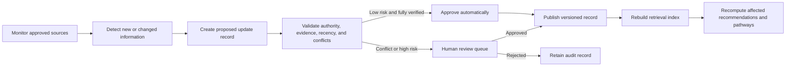

# Governed Knowledge-Base Update Workflow

## Decision

The Resource Discovery Agent may discover, extract, compare, score, and propose knowledge-base updates automatically. It must not silently overwrite trusted knowledge.

Automatic publication is allowed only when all of the following are true:

- the source is authoritative;
- the evidence is complete and attributable;
- no material conflict exists;
- the change is low risk;
- no protected or partner-confidential knowledge is exposed; and
- the update passes schema and policy validation.

All other changes require human review.

## Update Pipeline

## Update States

1. `DISCOVERED`
2. `EXTRACTED`
3. `VALIDATION_PENDING`
4. `CONFLICT_REVIEW`
5. `APPROVAL_PENDING`
6. `APPROVED`
7. `PUBLISHED`
8. `REJECTED`
9. `ARCHIVED`

## Change Types

- `NEW`: a previously unknown resource or program.
- `UPDATED`: a substantive change to an existing record.
- `EXPIRED`: a program, deadline, cohort, link, or opportunity is no longer active.
- `CONFLICT`: authoritative sources disagree or partner knowledge conflicts with a public source.
- `UNVERIFIED`: evidence is incomplete, stale, inaccessible, or non-authoritative.

## Sources to Monitor

The monitoring registry may include:

- current government program pages;
- current law and regulatory pages;
- official provider pages;
- universities and Extension services;
- 211 and other approved directories;
- partner websites;
- public datasets;
- approved INDYpendent Bytes research; and
- verified partnership knowledge.

A source must be registered before scheduled monitoring begins. Each registry record should define its authority class, refresh cadence, extraction method, expected fields, and escalation rule.

## Required Proposed-Update Record

Every proposed update must conform to `schemas/knowledge-update.schema.json` and include:

- source and update identifiers;
- source URL and responsible organization;
- authority class;
- retrieval and verification timestamps;
- exact evidence supporting each material claim;
- old and proposed values;
- confidence score;
- risk level;
- affected resources and user pathways;
- required review state; and
- publication and version metadata after approval.

## Mandatory Human Review

Human approval is required when an update changes or interprets:

- eligibility;
- legal or regulatory requirements;
- compliance obligations;
- funding amounts or financial terms;
- deadlines;
- cost;
- geographic service area;
- application route;
- program status;
- partner-specific knowledge;
- confidential information; or
- a decision rule that could materially change a recommendation.

Human review is also required whenever:

- two authoritative sources conflict;
- a source cannot be attributed;
- confidence is below the configured threshold;
- the record would disqualify a user from an opportunity;
- the change affects multiple pathways; or
- the change would notify users or partners of a material status change.

## Low-Risk Automatic Publication

A low-risk update may publish automatically when it is directly stated by an authoritative source and does not affect eligibility, rights, obligations, deadlines, money, compliance, or partner relationships.

Examples may include:

- corrected spelling in an official organization name;
- a canonical URL replacing a redirect while the underlying program is unchanged;
- non-material descriptive copy;
- a verified broken-link replacement pointing to the same official resource.

## Community and User Submissions

Ordinary user statements must never become trusted facts automatically.

User-submitted or community-submitted information enters a separate `COMMUNITY_SUBMISSION` queue. It may guide a verification search, but it may not alter a trusted record until corroborated by an authoritative source or explicitly approved as verified partner knowledge.

## Publication Rules

Publishing an approved update must:

1. preserve the prior version;
2. record the approving person or automated policy;
3. record the evidence and verification time;
4. update the canonical record;
5. rebuild or incrementally update the retrieval index;
6. recompute affected rankings, relationships, and pathways;
7. identify users who previously received a materially changed recommendation; and
8. preserve a complete audit trail.

Records are archived rather than silently deleted.

## Relationship Recalculation

After publication, the agent must reevaluate applicable relationships:

- `REQUIRES`
- `RECOMMENDS`
- `PREPARES_FOR`
- `RELATED_TO`
- `BEST_FOR`
- `UNLOCKS`
- `GOOD_AFTER`

A changed relationship must be explainable and versioned independently from the source record.

## Recommendation Impact Analysis

For every material update, determine:

- which users or user types are affected;
- which saved pathways are affected;
- whether candidate rankings change;
- whether prerequisites remain accurate;
- whether a previously recommended resource is now unavailable or unsuitable; and
- whether a user-facing correction or alert is warranted.

The system must not recompute silently when a change could materially disadvantage a user. Such changes require review and an auditable explanation.

## Administrative Review Interface

The admin interface should show:

- proposed updates;
- evidence and source links;
- current value versus proposed value;
- confidence and risk level;
- affected resources, relationships, and pathways;
- conflict details;
- approve, edit, reject, and archive actions;
- complete version history; and
- a manual `Run source check now` action.

## Failure Modes

The updater must fail closed when:

- the source is unavailable;
- parsing is incomplete;
- the source identity cannot be verified;
- required evidence is missing;
- schema validation fails;
- a conflict is detected;
- protected knowledge boundaries are uncertain; or
- index publication fails.

In these cases, preserve the proposal, set the appropriate review state, and leave the trusted record unchanged.

## Implementation Boundary

This document defines the required behavior and data contract. A production implementation still needs:

- a source-monitor registry;
- scheduled fetch jobs;
- extraction adapters;
- schema validation;
- comparison and conflict detection;
- a persistent proposal/review store;
- publication and rollback services;
- search-index refresh; and
- recommendation impact analysis.
